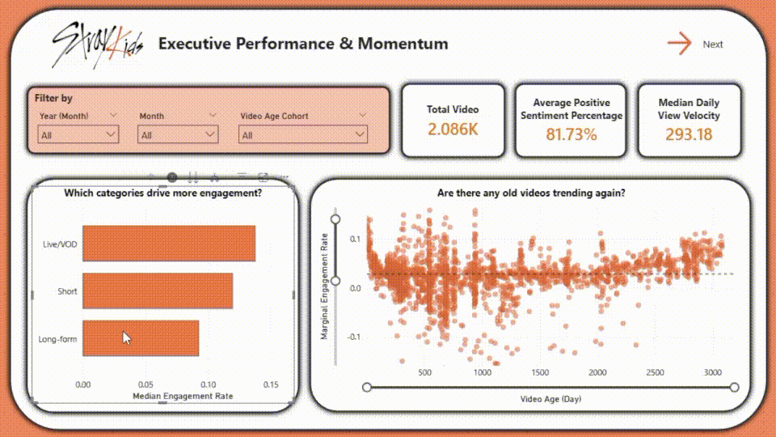
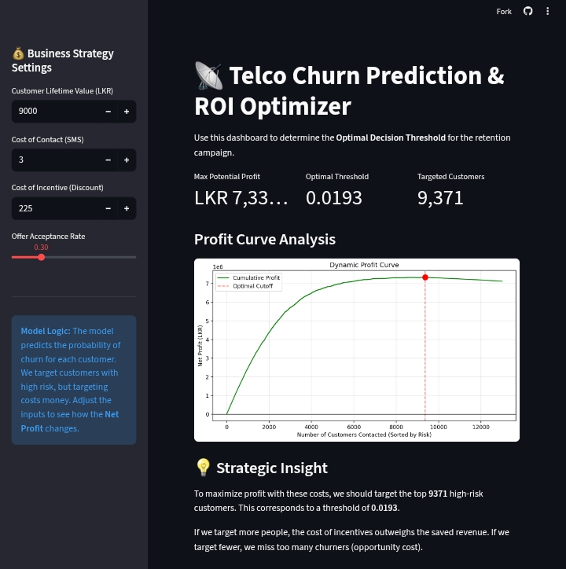

  <h1>Hi, I'm Yusuf Tejakusumah 👋</h1>
  <h3>Profit-Driven Data Scientist | Mathematics Educator</h3>

  
  

    

  *I translate complex mathematical concepts into actionable business strategies.   Specialized in machine learning, business analytics, and building data pipelines that deliver measurable ROI.*

---

## 🛠️ Technical Arsenal

---

## 🚀 Featured Projects

### 1. SKZ PACE: Predictive Analytics & Content Ecosystem 
*Bridging the gap between raw YouTube metadata and actionable digital strategy.*

  
  
<i>Interactive Power BI Dashboard visualizing content pillar engagement and lifetime velocity.</i>

**The Challenge:** Content strategy often relies on superficial native analytics. I built a system to extract granular, semantic insights into how different video formats influence fandom retention and long-term channel momentum.
**The Engine:** A full-stack ELT pipeline orchestrating daily metadata ingestion via **Dockerized Apache Airflow** and **GitHub Actions**. I engineered an NLP pipeline fine-tuning a **Hugging Face** model (XLM-RoBERTa), using **Gemini Pro Extended** to establish ground-truth labels for multilingual sentiment extraction.
**The Impact:** 
* Achieved an **87.76% accuracy rate** in sentiment extraction from 200k+ unstructured comments.
* Uncovered actionable business intelligence, including quantifying a "Viral Dilution Effect" and identifying core loyalty-driving content with an 18-day half-life.
* *Currently developing a Predictive A/B Scenario Simulator to forecast video engagement rates.*

 

### 2. Telco Customer Churn Prediction
*Maximizing Retention ROI via Behavioral Trend Analysis.*

  
  
<i>Streamlit dashboard analyzing the financial impact of predictive retention campaigns.</i>

**The Challenge:** Traditional churn models prioritize accuracy, which fails to account for the financial asymmetry between losing a high-value customer and the cost of sending a retention offer. The goal was to predict churn based purely on a user's first 4 weeks of behavior.
**The Engine:** Engineered 39 unit-invariant behavioral features (e.g., trend deltas, volatility shifts, Gini coefficients) to quantify user disengagement. Segmented users with **UMAP and K-Means** and trained an **XGBoost** model optimized via **Optuna** and tracked with **MLflow**.
**The Impact:**
* Achieved an **AUC-ROC of 0.924**.
* Shifted from a standard probability threshold (0.5) to a profit-optimized threshold (0.0201), prioritizing a **99% Recall** to catch almost every potential churner.
* Generated a projected **981% ROI** and **LKR 5.04M Net Profit** by identifying "Early Burnout" segments.

 

### 3. NYC Taxi Fare Prediction
*Geospatial Regression Analysis & Automated EDA.*

**The Challenge:** Estimating taxi fares in New York City requires processing complex spatial-temporal data and rigorous statistical validation.
**The Engine:** Constructed a robust regression pipeline using **Scikit-Learn Custom Transformers** to handle anomalies and calculate geodesic distances (via Ellipsoid GRS-80). I developed a custom Python module (`SimpleExploratoryDataAnalysis.py`) that dynamically executes statistical hypothesis tests (Normality, Correlation, Chi-Square) based on data distribution.
**The Impact:**
* Successfully benchmarked multiple models, selecting a **LightGBM** model optimized via Bayesian optimization (Optuna).
* Achieved a test **$R^2$ of 0.81** and an **RMSE of $4.06**, accurately capturing fare trends despite financial heteroscedasticity.

 

### 4. Logistic Regression from Scratch
*Algorithmic Deep Dive & Mathematical Engineering.*

> **Why no "Business Impact" here?** While my other projects focus on solving business problems, this project was built to demonstrate foundational mastery. This is a look *under the hood* of machine learning.

**The Motivation:** To move beyond the "Black Box" of standard libraries like Scikit-Learn by manually deriving and implementing the underlying optimization mathematics in pure **Python and NumPy**.
**The Mechanics:**
* **Stochastic Gradient Descent (SGD):** Engineered to handle large datasets and escape local minima by updating weights iteratively for single training examples, guided by a simulated annealing learning rate schedule.
* **Elastic Regularization:** Directly incorporated **L1 (Lasso)** and **L2 (Ridge)** penalties into the custom gradient calculation to enforce sparsity and prevent model overfitting.

---

## 🎓 Education & Background

* **B.S. in Mathematics Education | University of Siliwangi (Cum Laude, 3.81 GPA)**
  * *Focus: Pure Mathematics, Inferential Statistics, Geometric Analysis.*
* **Data Science For Business Development | Course-Net Indonesia**
  * *Focus: End-to-end ML lifecycles, Business Development, Predictive Analytics.*

 

  <i>Open to discussing data science, analytics, and business strategy. Feel free to connect!</i>

